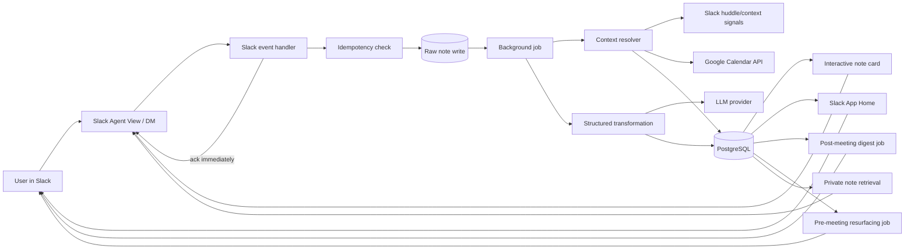

# Architecture

## Design goals

1. Never lose the raw note.
2. Acknowledge Slack events quickly.
3. Make all event handling idempotent.
4. Keep inferred data visibly separate from facts.
5. Degrade safely when Calendar, huddle metadata, or AI is unavailable.

## Proposed architecture

## Capture transaction

The critical sequence is:

1. verify Slack signature;
2. acknowledge event;
3. calculate idempotency key from Slack event/message identifiers;
4. insert raw note;
5. enqueue enrichment;
6. return.

No AI or Calendar call is allowed before the raw write.

## Core data model

### `notes`

| Field | Purpose |
|---|---|
| `id` | internal UUID |
| `workspace_id` | Slack workspace |
| `user_id` | Slack user |
| `source_message_ts` | Slack provenance/idempotency |
| `raw_text` | immutable original |
| `organized_text` | latest derived version |
| `note_type` | decision/action/question/idea/reference |
| `priority` | low/normal/high/critical |
| `status` | open/resolved/archived |
| `meeting_id` | nullable context link |
| `context_confidence` | exact/high/medium/low/unresolved |
| `created_at` | capture time |
| `transformation_version` | prompt/schema version |

### `note_revisions`

Stores every user edit and AI regeneration without altering `raw_text`.

### `meetings`

Stores normalized calendar/huddle context:

- provider and provider event ID;
- title;
- start/end;
- participant identifiers when authorized;
- huddle call/channel IDs;
- context source and confidence.

### `reminders`

Supports:

- fixed timestamps;
- relative-to-event rules;
- delivery state;
- snooze history.

### `workspace_installations`

Stores encrypted Slack and Calendar credentials and installation metadata.

## Context-resolution algorithm

1. Use explicit context from an interaction if present.
2. Query calendar events spanning capture time with a small tolerance.
3. Inspect cached Slack huddle state.
4. Inspect app-context information available for the agent conversation.
5. Score candidates.
6. Auto-attach only above a defined confidence threshold.
7. Ask the user when top candidates are close.

Example scoring inputs:

- event is currently active;
- user is an attendee;
- Slack huddle channel maps to a relevant conversation;
- event title/topic overlaps with note text;
- event began recently;
- one versus multiple candidates.

Text overlap must never be the only basis for high confidence.

## AI boundary

The LLM receives:

- raw note;
- verified meeting metadata;
- user timezone;
- explicit user preferences.

It does not receive unrelated Slack history by default.

The model returns JSON validated by a schema. Invalid output is rejected and the note remains verbatim.

## Recommended hackathon stack

### Application

- Node.js + TypeScript
- Slack Bolt for JavaScript
- Slack Agent View and App Home
- HTTP event endpoint for the deployed app
- Socket Mode as an optional local-development fallback

### Persistence

- PostgreSQL
- a lightweight ORM or parameterized SQL
- unique constraint on Slack event/message identity

### Background work

Use a durable job mechanism for:

- AI enrichment;
- end-of-meeting digests;
- reminder delivery;
- pre-meeting resurfacing.

A simple database-backed jobs table is sufficient for the hackathon if implemented carefully. Do not add a complex queue unless needed.

### Deployment

A single externally reachable service is preferable for the deadline. Keep the Slack event handler and API together unless deployment constraints force a split.

## Hackathon fallback architecture

If Google OAuth or native huddle metadata becomes a blocker:

- use seeded calendar events for the demo workspace;
- provide a manual “Choose meeting” control;
- preserve the exact same product flow;
- disclose the fallback in the architecture diagram.

Do not fake an automatic integration in the submission.

## Security considerations

- verify Slack request signatures;
- encrypt OAuth tokens at rest;
- request least-privilege Slack and Google scopes;
- isolate notes by workspace and user in every query;
- log identifiers and failures, not raw note bodies;
- implement deletion/export paths;
- never post private notes into a shared channel without explicit confirmation.
