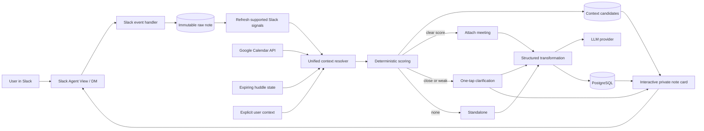

# Architecture

## Design goals

1. Never lose the raw note.
2. Acknowledge Slack events quickly.
3. Make all event handling idempotent.
4. Keep inferred data visibly separate from facts.
5. Degrade safely when Calendar, huddle metadata, or AI is unavailable.
6. Never resolve close context candidates by provider ordering.

## Architecture

The current hackathon implementation performs enrichment after the durable raw write in the same application process. The production architecture should move context lookup and AI enrichment to a durable database-backed job queue without changing the raw-write-first contract.

## Capture sequence

1. Slack delivers a private `message.im` event.
2. Bolt acknowledges the event.
3. Margin validates that the source is a DM.
4. Margin inserts the exact raw note with a Slack idempotency key.
5. Margin posts one private processing card and stores its channel/timestamp.
6. Margin refreshes supported Slack huddle and active-view signals.
7. Margin resolves and persists all context candidates.
8. Margin transforms the note using only the selected verified meeting, when one exists.
9. Margin updates the existing processing card in place.

No AI, Calendar, or huddle lookup occurs before the raw note write.

## Core data model

### `notes`

| Field | Purpose |
|---|---|
| `id` | internal UUID |
| `workspace_id`, `user_id` | owner scope |
| `source_channel_id`, `source_message_ts` | Slack provenance and idempotency |
| `raw_text` | database-immutable original |
| `organized_text` | latest derived/user-edited version |
| `note_type` | decision/action/question/idea/reference |
| `priority` | low/normal/high/critical |
| `status` | open/resolved/archived |
| `meeting_id` | selected nullable context link |
| `context_source` | Calendar, huddle, explicit, or standalone |
| `context_confidence` | exact/high/medium/low/unresolved |
| `context_resolution_status` | pending/attached/needs clarification/standalone |
| `card_channel_id`, `card_message_ts` | private Slack card reference |
| `transformation_version` | prompt/schema version |

### `note_context_candidates`

Stores every candidate considered for a note:

- source and owner-scoped meeting ID;
- integer score from 0–100;
- confidence;
- structured evidence signals;
- selected state.

Constraints require exactly shaped standalone versus meeting candidates, owner-scoped foreign keys, and at most one selected candidate per note.

### `note_revisions`

Stores every AI and user revision without altering `raw_text`.

### `meetings`

Stores normalized Calendar, huddle, or explicit meeting records:

- provider and provider event/call ID when available;
- title, including an explicit title-unavailable huddle label;
- start/end;
- limited participant identifiers when authorized;
- source confidence.

### `slack_huddle_states` and `slack_active_contexts`

Short-lived signal caches. They do not store messages, channel names, audio, transcripts, or participant history.

### `oauth_connections` and `oauth_authorization_states`

Stores encrypted Google credentials and hashed, expiring, one-time OAuth state.

### `reminders`

Supports fixed timestamps and event-relative rules. Delivery is implemented in later reminder work.

## Context-resolution algorithm

1. Load the owner-scoped note.
2. Retrieve Calendar events in the five-minute capture window.
3. Read the current expiring Slack huddle and active-view signals.
4. Normalize explicit, Calendar, huddle, and standalone candidates.
5. Score all candidates together.
6. Persist the complete candidate set and note resolution atomically.
7. Auto-attach only when the top score is at least **85** and leads the second meeting candidate by **more than 15 points**.
8. Otherwise render ranked buttons plus **No meeting**.
9. A user selection becomes explicit/exact context and updates the existing card.

Current score rules are documented in [CONTEXT_RESOLUTION.md](CONTEXT_RESOLUTION.md). Text similarity is capped as a small bonus and can never independently create high confidence.

Active-view channel/message context is retained as an independent signal. It is not treated as proof that a huddle occurred in that channel because Slack does not document that mapping.

## AI boundary

The model receives:

- immutable raw note text;
- selected verified meeting title and start/end time, when attached;
- context confidence;
- user timezone.

It does not receive:

- unresolved candidate titles as hidden context;
- Calendar descriptions or locations;
- attendee identifiers;
- Slack channel history;
- huddle audio or transcripts;
- external tools.

The model returns schema-validated JSON. Invalid output leaves the note verbatim.

## Deployment

The current development setup uses:

- Node.js and TypeScript;
- Slack Bolt with Socket Mode;
- PostgreSQL;
- a small HTTP OAuth callback server;
- OpenAI structured outputs.

A production deployment should use one externally reachable service, HTTP Slack events where appropriate, a durable job table, and periodic cleanup/delivery workers.

## Hackathon fallback architecture

If live Google or native huddle signals cannot be demonstrated in the sandbox:

- use seeded owner-scoped meeting records;
- retain the same scoring and clarification path;
- use the existing Meeting control;
- disclose the fallback in the architecture diagram and demo.

Do not present seeded data as a live automatic integration.

## Security considerations

- verify Slack request signatures through Bolt;
- encrypt OAuth tokens at rest;
- hash and atomically consume OAuth state;
- request least-privilege Slack and Google scopes;
- isolate notes, meetings, candidates, and actions by workspace and user;
- require DM channel IDs for card storage and updates;
- log identifiers and failure categories, not note text or tokens;
- expire Slack context signals;
- never post private notes into a shared channel without explicit confirmation.
